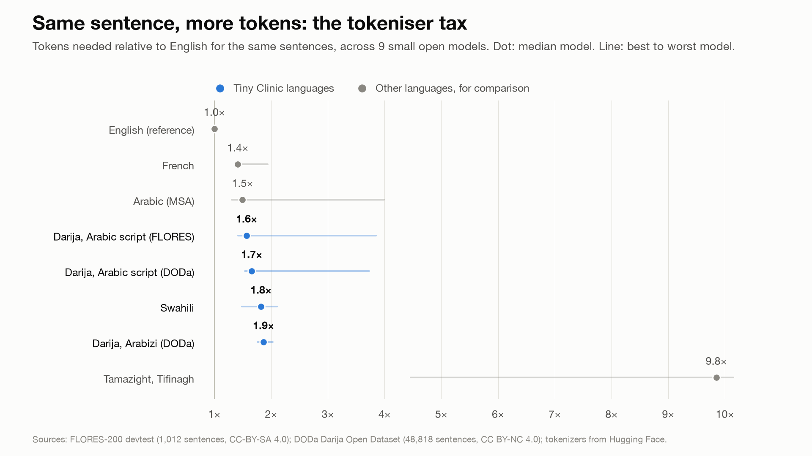
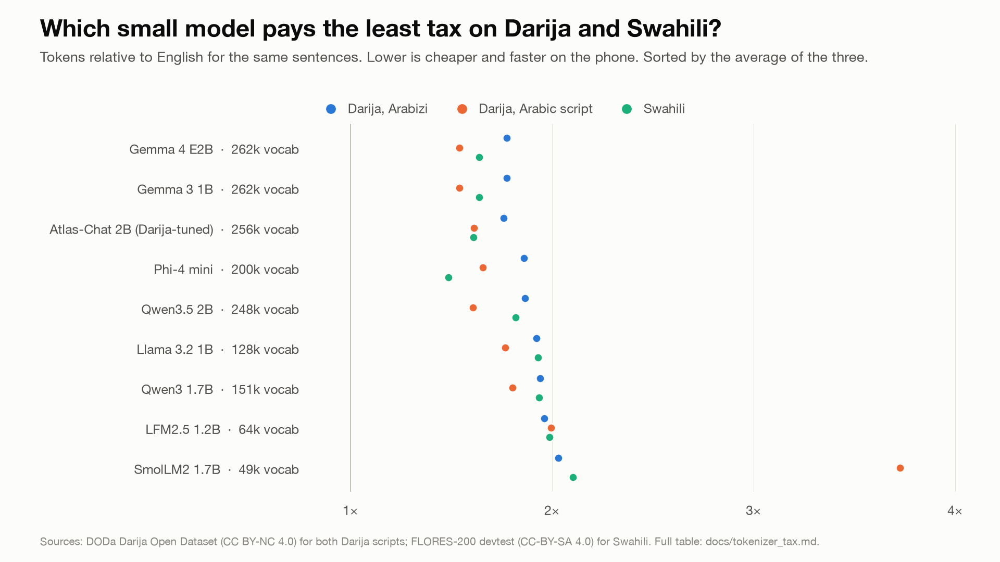

# Tokeniser tax

Tokens a language needs relative to English for the same sentences (English = 1.00).
Generated by `scripts/tokenizer_tax.py`; raw counts in `data/results/tokenizer_tax.csv`.

Models are sorted by the average of Darija Arabizi, Darija Arabic script (both DODa) and Swahili.

| Model | Vocab | French | MSA | Darija ar (FLORES) | Darija ar (DODa) | Darija Arabizi (DODa) | Swahili | Tamazight | Avg (ours) |
|---|---:|---:|---:|---:|---:|---:|---:|---:|---:|
| Gemma 4 E2B | 262,144 | 1.41 | 1.47 | 1.52 | 1.54 | 1.78 | 1.64 | 4.46 | **1.65** |
| Gemma 3 1B | 262,145 | 1.41 | 1.47 | 1.52 | 1.54 | 1.78 | 1.64 | 4.46 | **1.65** |
| Atlas-Chat 2B (Darija-tuned Gemma 2) | 256,000 | 1.36 | 1.50 | 1.57 | 1.61 | 1.76 | 1.61 | 4.96 | **1.66** |
| Phi-4 mini | 200,029 | 1.37 | 1.38 | 1.48 | 1.66 | 1.86 | 1.49 | 10.15 | **1.67** |
| Qwen3.5 2B | 248,070 | 1.40 | 1.31 | 1.42 | 1.61 | 1.87 | 1.82 | 9.92 | **1.77** |
| Llama 3.2 1B | 128,256 | 1.60 | 1.65 | 1.71 | 1.77 | 1.92 | 1.93 | 10.04 | **1.87** |
| Qwen3 1.7B | 151,669 | 1.58 | 1.63 | 1.69 | 1.81 | 1.94 | 1.94 | 5.02 | **1.89** |
| LFM2.5 1.2B | 64,402 | 1.44 | 1.89 | 1.95 | 2.00 | 1.96 | 1.99 | 9.85 | **1.98** |
| SmolLM2 1.7B | 49,152 | 1.94 | 3.99 | 3.85 | 3.73 | 2.03 | 2.11 | 10.15 | **2.62** |

Gemma 4 E2B and Gemma 3 1B give identical counts on every language: they share a tokenizer.

## Data and what it does not cover

- **FLORES-200 devtest** (Meta, CC-BY-SA 4.0): 1,012 sentences, professionally translated from English Wikipedia-style text. Formal register; no clinical or spoken language.
- **DODa sentences** (Darija Open Dataset, CC BY-NC 4.0): 48,818 short conversational sentences with English, Arabizi and Arabic-script versions. Arabizi spelling varies a lot between writers; DODa uses one convention (3 = ع, 7 = ح, 9 = ق), so real notes may tokenise differently. The license is non-commercial, so DODa is used only to count tokens, never as training data.
- FLORES and DODa are different sentences, so compare premiums within a dataset, not across them.
- Neither covers health-worker notes, French code-switching inside Darija, or typos.
- A premium measures cost (tokens, latency, context), not how well the model understands the language.
- Gemma 3 1B and Llama 3.2 1B are gated upstream, so their tokenizers come from unsloth's ungated mirrors (`unsloth/gemma-3-1b-it`, `unsloth/Llama-3.2-1B-Instruct`). The rest come from the original repos.
